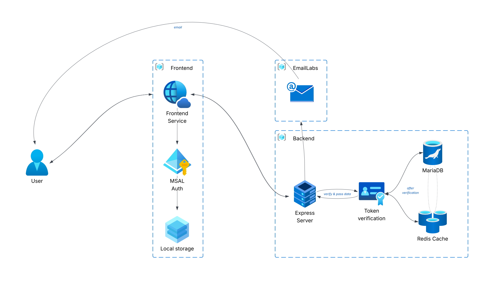

import { FileTree } from "@astrojs/starlight/components";

Our platform is built on three core parts that work together

---

### Frontend Service

**Technology:** React 19 + TypeScript

**Main Features:**

* **Student Interface:** Tools and views for student activities
* **Teacher Interface:** Tools for managing classes and student resources
* **Authentication:** Integrated with Microsoft Authentication Library (MSAL) and state management
* **Responsive Design:** Optimized for both desktop and mobile devices

**Communication:** Connects to backend services using RESTful APIs

---

### Backend Service

**Technology:** Node.js 24+ with Express

**Main Features:**

* **Authentication & Authorization:** Uses JWTs and MSAL tokens to manage access
* **Security:** Rate limiting and input validation
* **Email Support:** Sends emails using Amazon SES
* **Logging:** Writes logs to files for monitoring and debugging

**API Docs:** Fully documented using OpenAPI

---

### Database Layer

* **Primary Database:** MariaDB 11+
* **Cache:** Redis for faster query performance

---

## Project Structure

The project uses a **modular, feature-based architecture** to keep the code organized, scalable, and easy to maintain.

---

<FileTree>
    - projectMS/
        - .husky/                     (Git hooks and pre-commit configuration)
        - **dbinit**
            - init.sql                  (MariaDB database initialization script)
        - **frontend**               (React application)
            - public/                   (Static assets: favicon, etc.)
            - src/
                - assets/                 (Images, icons, and static resources)
                - config/                 (Application configuration files)
                - core/                   (Core: router, auth, API helpers)
                - features/               (Feature-based modules and components)
                - locales/                (Internationalization and translation files)
                - shared/                 (Reusable UI components and utilities)
                - App.tsx                 (Main application component)
                - main.tsx                (Application entry point and providers)
            - Dockerfile                (Container configuration for production)
            - package.json              (Dependencies and scripts)
            - pnpm-lock.yaml           (Dependency lock file)
            - **index.html**            (HTML entry point)
        - **server**                 (Express.js backend)
            - logs/                     (Winston log files when logging is enabled)
            - src/
                - config/                 (Server configuration files)
                - core/                   (Application logic: types, enums, interfaces)
                - database/               (Database schemas, migrations, and utilities)
                - features/               (Feature-based API modules)
                - shared/                 (Shared utilities and helper functions)
                - app.ts                  (Express application setup)
                - **index.ts**            (Server entry point)
            - .env                      (Environment variables)
            - Dockerfile                (Container configuration)
            - openapi.yaml              (API specification and documentation)
            - package.json              (Dependencies and scripts)
            - pnpm-lock.yaml           (Dependency lock file)
        - biome.json                  (Code linting and formatting configuration)
        - commitlint.config.js        (Commit message linting rules)
        - docker-compose.yml          (Production container orchestration)
        - docker-compose.dev.yml      (Development environment setup)
        - package.json                (Root workspace configuration)
        - tsconfig.json               (TypeScript compiler configuration)
</FileTree>

For step-by-step instructions on installation and setup, please check **installation guide**.